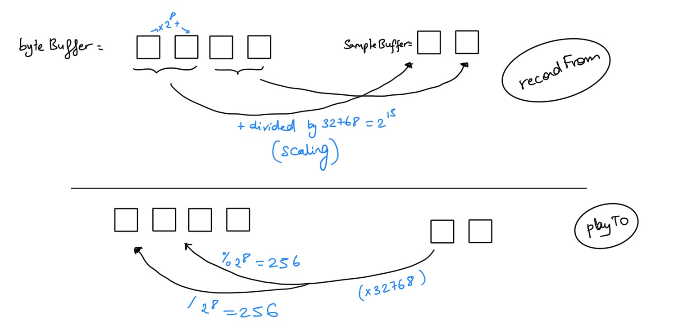

# Realtime Audio Processing

Built an application that can record from a microphone in real time, display the waveform & the spectrum, apply some effects and playback.

#### Utilized:

- Java
- [JavaFX](https://openjfx.io) with CSS (to build simple, organized and eye catching User Interfaces)
- [Package javax.sound.sampled](https://docs.oracle.com/javase/8/docs/api/javax/sound/sampled/package-summary.html) (for capture, processing and playback of sampled audio data)

> STARTED BY CREATING **PAINT** here is my source code: [https://github.com/jathurchan/JavaLabs](https://github.com/jathurchan/JavaLabs)

### Explanation (how I converted from Bytes to double and vice-versa)

## Structure of the Project

